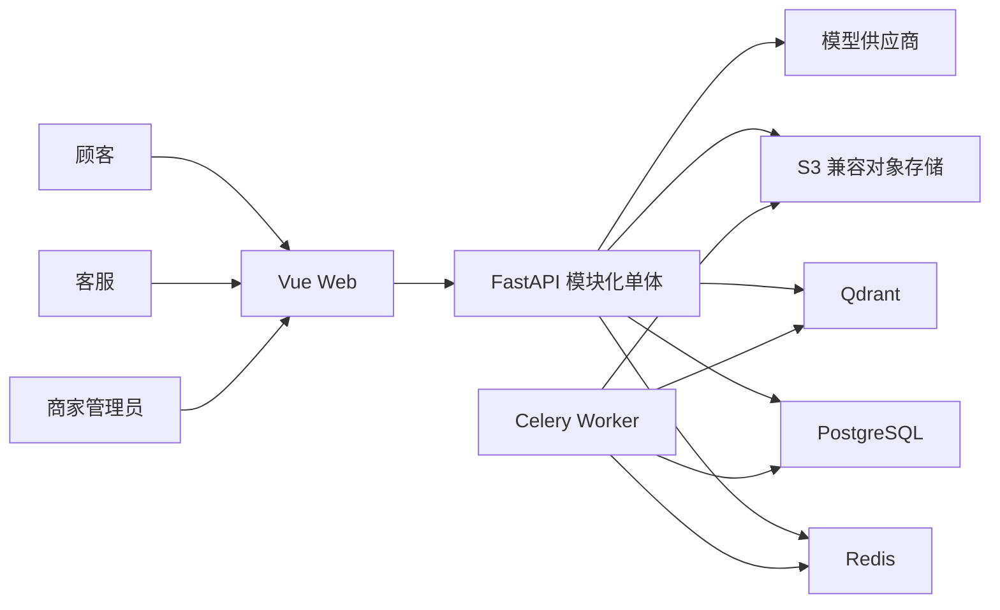

# 初始架构

本文档描述 M0 阶段的目标架构。它用于约束后续实现，不代表所有组件会在第一个迭代同时完成。

## 1. 架构原则

1. **模块化单体优先**：先降低部署和调试复杂度，同时保持清晰模块边界。
2. **确定性代码控制边界**：LLM 负责理解和生成，权限、状态转换和高风险规则由普通代码执行。
3. **默认拒绝越权**：租户和资源所有权来自认证上下文，不信任模型或客户端提供的租户标识。
4. **副作用显式化**：只读 Tool 与写入 Tool 分离，写入操作要求幂等，风险操作要求人工确认。
5. **可恢复而非仅可运行**：会话、任务、文档版本和 Agent 状态都需要持久化标识。
6. **证据驱动回答**：RAG 回答必须携带引用；证据不足时拒答或转人工。

## 2. 系统上下文



## 3. 应用模块

| 模块 | 职责 | 不负责 |
|---|---|---|
| Identity | 登录、令牌、用户状态 | 业务资源授权 |
| Tenancy | 租户上下文和租户级隔离策略 | 前端显示控制 |
| Conversations | 会话、消息、流式生命周期、反馈 | 自行决定 Tool 权限 |
| Knowledge | 文档、版本、解析任务、Chunk 生命周期 | 生成最终回答 |
| Retrieval | 混合检索、融合、重排、权限过滤 | 文档管理状态转换 |
| Agent | 工作流状态、节点路由、Checkpoint | 绕过权限或业务规则 |
| Tools | 参数校验、业务查询、幂等、审计 | 自由修改 Agent 状态 |
| Tickets | 工单状态、转人工、审批 | 自动执行真实退款 |
| Audit | 安全相关行为记录和查询 | 保存敏感原文或 Secret |

## 4. 数据归属

### PostgreSQL

- 租户、用户、角色和成员关系。
- 会话、消息、消息版本和反馈。
- 文档、文档版本、解析任务和索引状态。
- 模拟订单、物流、退款和工单。
- Tool 调用、审批和审计事件。
- LangGraph Checkpoint（具体实现将在 M4 前确认）。

### Qdrant

- 文档 Chunk 的 Dense 和 Sparse 表示。
- 用于权限过滤和引用的最小元数据，例如租户、文档、版本和状态标识。
- Qdrant 不是业务事实的唯一数据源；PostgreSQL 保留权威生命周期状态。

### Redis

- 短期缓存、限流计数和 Celery 通信所需数据。
- Redis 中的数据不能成为用户、订单、工单或审计记录的唯一副本。

### 对象存储

- 原始上传文件和必要的派生文件。
- 数据库保存对象键、校验值、版本和处理状态。

## 5. 核心数据流

### 文档摄取

```text
上传请求
→ 验证文件和权限
→ 保存原文件
→ 创建文档版本与任务
→ Worker 解析、清洗和切分
→ 生成 Dense/Sparse 表示
→ 写入带租户和版本信息的索引
→ 原子切换当前生效版本
→ 异步清理旧版本索引
```

如果处理中途失败，旧的生效版本继续可用，新版本保持失败状态，不进行半完成切换。

### 知识回答

```text
认证上下文
→ 构造服务端租户/权限过滤条件
→ Dense + Sparse 召回
→ 融合与重排
→ 证据阈值判断
→ 生成带引用回答或拒答
→ 保存消息、引用和耗时信息
```

### Tool 调用

```text
Agent 产生结构化 Tool 请求
→ Schema 校验
→ 服务端身份、租户和资源权限校验
→ 设置超时与幂等上下文
→ 执行业务服务
→ 记录审计结果
→ 返回受限、结构化结果给 Agent
```

## 6. Agent 边界

第一版使用一个有明确节点和最大步骤数的 LangGraph 工作流：

```text
接收消息
→ 识别意图
→ [知识检索 | 订单查询 | 物流查询 | 退款查询 | 转人工]
→ 检查结果
→ [生成回答 | 拒答 | 创建工单]
→ 保存状态
```

- 模型不能自行构造数据库查询。
- 模型不能指定可信租户身份。
- 模型不能执行退款。
- Tool 结果必须作为不可信外部输入处理。
- 工作流设置最大循环次数和 Token 预算。

## 7. 部署拓扑

受控 Beta 部署在一台 Linux 服务器，通过 Docker Compose 管理：

- 反向代理与 HTTPS。
- Web 静态资源。
- FastAPI API。
- Celery Worker。
- PostgreSQL。
- Redis。
- Qdrant。
- MinIO（仅在未采用托管对象存储时）。

生产数据卷、备份位置、Secret 注入、资源限制和恢复步骤必须在部署前明确。详细监控平台属于后续阶段，但 M0/M1 起必须保留结构化日志、请求标识和健康检查设计。

## 8. 失败与降级原则

| 故障 | 第一版行为 |
|---|---|
| 模型超时或不可用 | 有限重试；失败后提示暂时不可用或转人工。 |
| Qdrant 不可用 | 不生成伪造知识答案，允许不依赖知识库的安全功能继续。 |
| Tool 超时 | 根据操作性质决定是否重试；不确定结果的写操作先按幂等键查询。 |
| 文档解析失败 | 保留错误状态和原因，旧生效版本继续服务。 |
| Worker 重启 | 未确认完成的任务可安全重试。 |
| API 重启 | 已持久化的会话和 Agent 状态可以继续。 |
| 数据库迁移失败 | 停止部署，不将失败版本切换为健康版本。 |

## 9. M1 前需要确认的问题

- 本地开发使用原生 Docker Desktop 还是其他兼容运行环境。
- 第一阶段使用哪一家模型与 Embedding API，以及可接受的月度预算。
- 是否使用托管对象存储，还是先在本地使用 MinIO。
- 前端采用单一 Vue 应用还是顾客端与管理端分入口构建。
- 首次公开部署使用的服务器、域名和证书条件。

